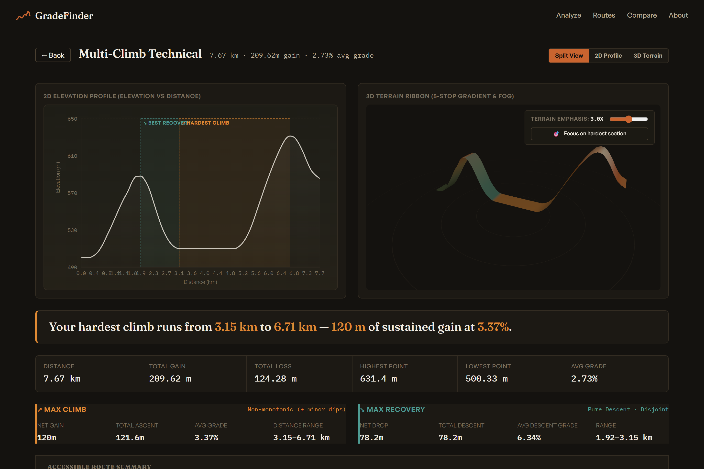
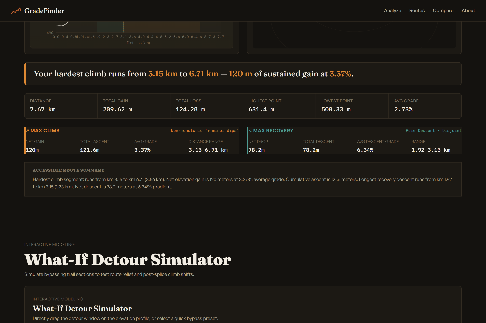
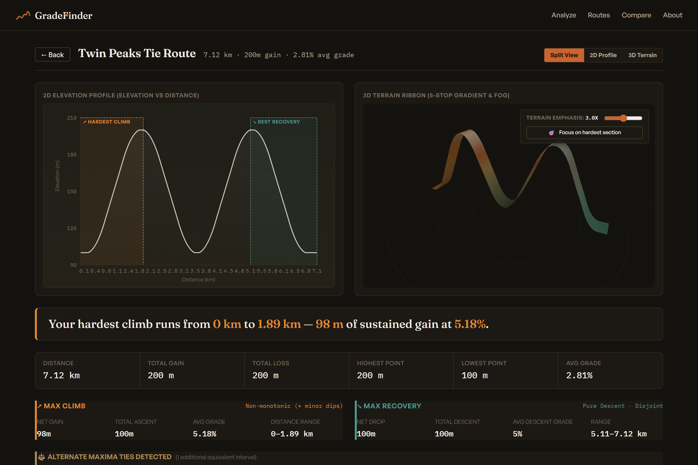
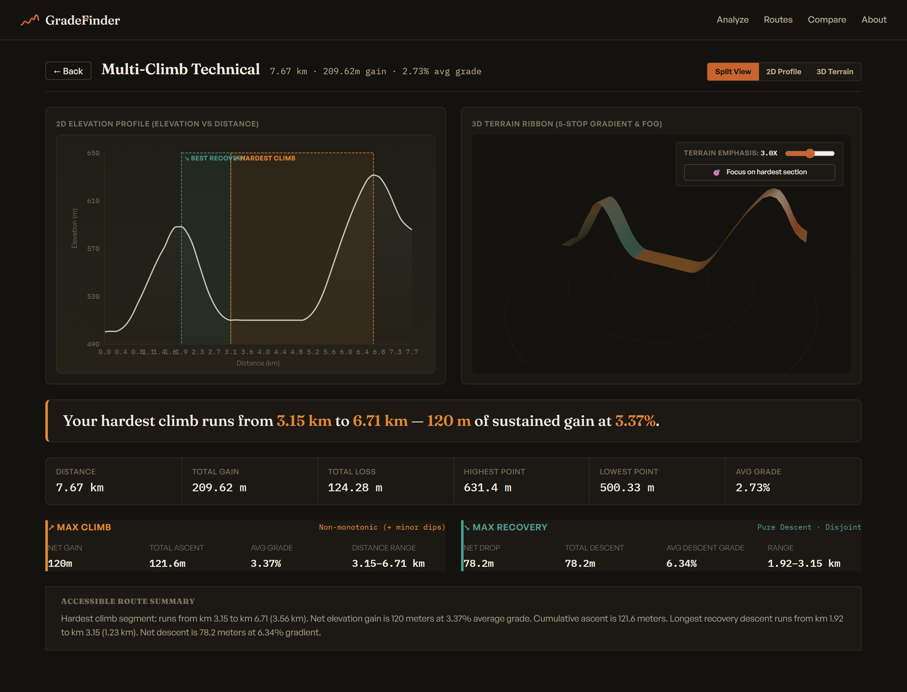
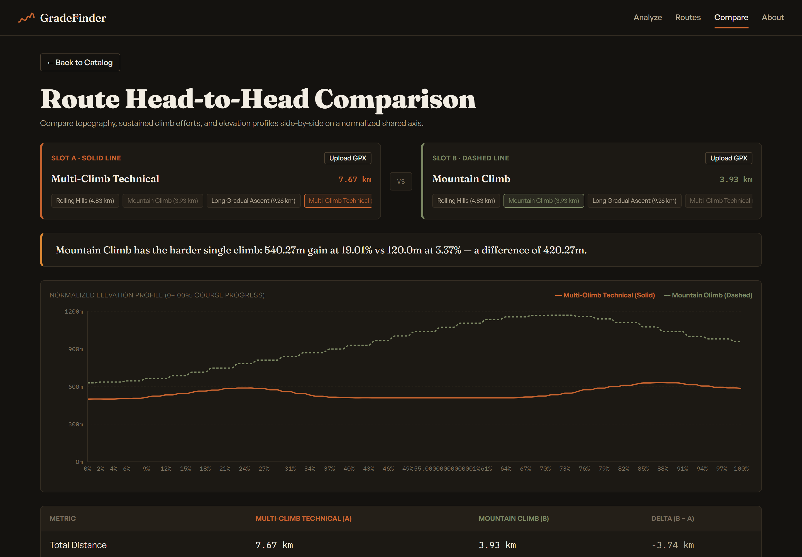
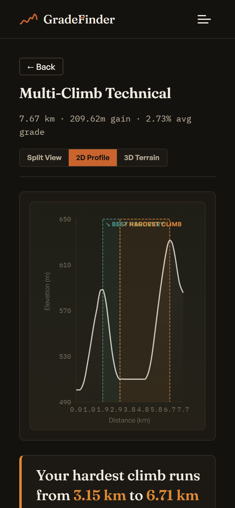

# GradeFinder

> **High-Precision Topographic Route Analysis, Climb Detection & What-If Simulation Engine**

GradeFinder is an engineering-grade elevation profile analyzer for endurance athletes, race directors, and route planners. It detects sustained climbs and recovery segments from GPX track files using a specialized **Kadane algorithm with bounded descent tolerance**, offers interactive **2D profile charts** and **3D terrain ribbons with bidirectional hover-sync**, enables **what-if detour simulations**, and provides **head-to-head route comparisons**.

---

## 📸 Screenshots & UI Showcase

### Landing Page & Demo Routes


### Highlighted Climb & Recovery Analysis (2D Profile with Dual-Metric Transparency)


### 3D Terrain Ribbon (Interactive Exaggeration Slider & Camera Focus on Hardest Section)


### Alternate Maxima Tie Surfacing & Accessible Text Fallback


### What-If Detour Simulator & Spliced Elevation Impact


### Custom Upload Head-to-Head Route Comparison


### Mobile & Low-Power Graceful 3D Degradation


---

## 🏗️ System Architecture

```mermaid
graph TD
    subgraph Frontend ["Frontend (React 18 + TypeScript + Vite)"]
        UI[App Shell / Router]
        Home[HomePage - Drag & Drop Upload / Demo Selection]
        Analysis[AnalysisPage - Metrics, Detour Simulator & View Toggle]
        Compare[ComparisonPage - Side-by-Side Topographic Evaluation]
        EChart[ElevationChart - 2D Recharts Profile & Reference Areas]
        TView[TerrainView - Three.js 3D Ribbon, Exaggeration & Camera Focus]
        A11y[Accessible Screen-Reader Section & Low-Power Fallback]
    end

    subgraph Backend ["Backend (Spring Boot 3 + Java 21)"]
        Controller[RouteAnalysisController - REST API Endpoints]
        Parser[GpxParser - Hardened SAX Parser with XXE Protection]
        Engine[ToleranceKadaneEngine - O(N) Climb & Recovery Detection]
        Classifier[GradientClassifier - Zone Classification]
        Splicer[RouteSplicer - What-If Route Splicing & Detour Math]
        CompService[RouteComparisonService - Head-to-Head Topographic Delta Engine]
    end

    Home -->|Upload GPX / Select Demo| Controller
    Analysis -->|Simulate Detour| Controller
    Compare -->|Compare Route A vs B| Controller
    Controller --> Parser
    Controller --> Engine
    Controller --> Classifier
    Controller --> Splicer
    Controller --> CompService
    EChart <-->|Bidirectional Hover Sync| TView
```

---

## 🧠 Core Algorithm: Kadane with Bounded Descent Tolerance

### 1. The Telescoping Property
Given a route of $N$ points with elevations $E_0, E_1, \dots, E_{N-1}$, the step deltas are:
$$\Delta_i = E_{i+1} - E_i$$
By telescoping summation:
$$\sum_{k=i}^{j-1} \Delta_k = E_j - E_i$$
Maximizing the subarray sum $\sum_{k=i}^{j-1} \Delta_k$ directly maximizes the net elevation gain between start point $i$ and summit point $j$.

### 2. Bounded Descent Tolerance State Machine

Standard Kadane's algorithm resets whenever the running sum drops below zero. However, natural cycling climbs contain minor dips (rollers) that an athlete absorbs without breaking the continuity of the climb. GradeFinder formalizes this using a state machine tracking running sum, local peak, and dip accumulator:

```mermaid
flowchart TD
    Start([Next Delta Step: Δ]) --> CheckExclusion{Inside Excluded<br/>Climb Interval?}
    CheckExclusion -- Yes --> FinalizeExcluded[Finalize current candidate<br/>Skip to excludedEnd]
    CheckExclusion -- No --> CheckDelta{Δ >= 0?}

    CheckDelta -- Yes (Ascent) --> AddAscent[currentGain += Δ<br/>descentSinceLastPeak = 0<br/>currentPeakEnd = i + 1]
    AddAscent --> NextStep

    CheckDelta -- No (Descent) --> AccumulateDip[descentSinceLastPeak += -Δ]
    AccumulateDip --> CheckTolerance{descentSinceLastPeak > tolerance?}

    CheckTolerance -- Yes (Broken Climb) --> FinalizeCandidate[Finalize candidate at currentPeakEnd<br/>Record in allCandidates<br/>Update bestGain if currentGain > bestGain<br/>Reset: currentGain = 0, currentStart = i + 1]
    FinalizeCandidate --> NextStep

    CheckTolerance -- No (Within Tolerance) --> AbsorbDip[currentGain += Δ]
    AbsorbDip --> CheckInvariantI5{currentGain < 0?<br/>(Invariant I5)}

    CheckInvariantI5 -- Yes (Strictly Worse Start) --> KadaneReset[Reset: currentGain = 0<br/>currentStart = i + 1<br/>descentSinceLastPeak = 0]
    CheckInvariantI5 -- No --> NextStep

    NextStep([Advance to next point]) --> LoopEnd{More deltas?}
    LoopEnd -- Yes --> Start
    LoopEnd -- No --> FinalizeLast[Finalize trailing candidate<br/>Filter minGain & minGrade<br/>Scan allCandidates for Alternate Maxima ties]
    FinalizeLast --> Done([Return Result])
```

### 3. Kadane Negative-Sum Reset (Invariant I5)
A critical correctness requirement is that tolerance absorption must **never** cause the algorithm to retain a strictly worse starting point than an available better one. Whenever `currentGain < 0` at any point in the route, the algorithm resets immediately (`currentStart = i + 1, currentGain = 0`), regardless of whether `descentSinceLastPeak` has exceeded tolerance.

### 4. Disjoint Segment Logic (Climb Exclusion & Case S Generality)
Flat valleys between climbs (such as long plateaus where $\Delta_i = 0$) can be absorbed by both climb and recovery algorithms because zero deltas incur zero penalty. To guarantee mathematical disjointness:
1. The engine detects the primary `maxClimbSegment` over $[ \text{climbStart}, \text{climbEnd} ]$.
2. The recovery search (`negate = true`) evaluates candidate regions **excluding** $[ \text{climbStart}, \text{climbEnd} ]$.
3. The engine evaluates candidate windows on **both sides** of the excluded climb interval (evaluating candidate descents before and after the climb and selecting the global optimum).
4. Any candidate whose gain/descent equals the global optimum within floating tolerance is preserved and surfaced as an **Alternate Maximum** (`alternateMaxima`).

---

## 📊 Dual-Metric Philosophy

In endurance sports, confusion often arises between two distinct definitions of elevation gain:
1. **Net Gain**: The topographic displacement from start to peak ($E_{\text{summit}} - E_{\text{base}}$).
2. **Cumulative Ascent**: The sum of all upward micro-steps along the trail ($\sum \max(0, \Delta E_i)$).

If a 120m hill has small rollers adding 1.6m of dips, the Net Gain is **120.0m**, while Cumulative Ascent is **121.6m**.
GradeFinder rejects the practice of silently picking one and hiding the other. Both metrics are computed on the backend, exposed in DTOs, and displayed side-by-side with clarity badges (`⚠️ Non-monotonic (+ minor dips)` vs `✓ Pure Ascent`).

---

## 🌐 API Specification & Endpoint Examples

The backend exposes four core REST endpoints under `/api/routes`:

### 1. `GET /api/routes/demo`
Lists all preloaded demonstration routes designed to exercise specific algorithm edge cases.

**Response `200 OK`:**
```json
[
  {
    "id": "rolling-hills",
    "name": "Rolling Hills",
    "description": "Gentle rolling terrain with multiple small climbs and descents — tests that the algorithm correctly identifies the largest sustained climb among several candidates.",
    "distanceKm": 4.83
  },
  {
    "id": "mountain-climb",
    "name": "Mountain Climb",
    "description": "A single long, steep mountain ascent — the classic use case. Tests straightforward climb detection.",
    "distanceKm": 3.93
  },
  {
    "id": "long-gradual",
    "name": "Long Gradual Ascent",
    "description": "A very long but gentle uphill — tests that a low-grade climb with significant total gain is correctly detected.",
    "distanceKm": 9.26
  },
  {
    "id": "multi-climb",
    "name": "Multi-Climb Technical",
    "description": "Two distinct climbs separated by a long flat valley — the key test case proving the descent-tolerance algorithm correctly splits them instead of bridging.",
    "distanceKm": 7.67
  },
  {
    "id": "flat-route",
    "name": "Flat Route",
    "description": "A nearly flat route with negligible elevation change — exercises the 'no significant climb' path honestly.",
    "distanceKm": 2.47
  }
]
```

---

### 2. `POST /api/routes/analyze`
Analyzes a custom GPX file or preloaded demo route.

**Query Parameters (or Multipart Form Data):**
- `demoRouteId` (optional): ID of demo route (e.g., `multi-climb`).
- `file` (optional): Multipart `.gpx` file payload (max 10 MB).
- `descentTolerance` (optional, default `3.0`): Max descent in meters before climb breaks.
- `minSignificantGain` (optional, default `20.0`): Minimum climb net gain in meters.
- `minSignificantGrade` (optional, default `1.5`): Minimum average gradient in %.

**Response `200 OK`:**
```json
{
  "routeId": "multi-climb",
  "routeName": "Multi-Climb Technical",
  "summary": {
    "distanceKm": 7.67,
    "totalGainM": 209.62,
    "totalLossM": 124.28,
    "highestPointM": 631.4,
    "lowestPointM": 500.33,
    "avgGradePercent": 2.73
  },
  "hasSignificantClimb": true,
  "maxClimbSegment": {
    "startIndex": 23,
    "endIndex": 49,
    "startDistanceKm": 3.15,
    "endDistanceKm": 6.71,
    "gainM": 120.0,
    "avgGradePercent": 3.37,
    "lengthKm": 3.56,
    "totalAscentM": 121.6,
    "totalDescentM": 0.0,
    "overlapsWithClimb": false
  },
  "alternateMaxima": [],
  "hasSignificantRecovery": true,
  "maxRecoverySegment": {
    "startIndex": 14,
    "endIndex": 23,
    "startDistanceKm": 1.92,
    "endDistanceKm": 3.15,
    "gainM": 78.2,
    "avgGradePercent": 6.34,
    "lengthKm": 1.23,
    "totalAscentM": 0.0,
    "totalDescentM": 78.2,
    "overlapsWithClimb": false
  },
  "zones": [
    { "startIndex": 0, "endIndex": 2, "type": "FLAT" },
    { "startIndex": 2, "endIndex": 13, "type": "CLIMBING" }
  ],
  "renderPoints": [
    {
      "index": 0,
      "lat": 44.0,
      "lon": 7.5,
      "elevationM": 500.33,
      "smoothedElevationM": 500.33,
      "distanceKm": 0.0
    }
  ],
  "warnings": [],
  "algorithmParameters": {
    "descentTolerance": 3.0,
    "ascentTolerance": 3.0,
    "minSignificantGain": 20.0,
    "minSignificantGrade": 1.5,
    "smoothingWindow": 5
  },
  "message": null
}
```

---

### 3. `POST /api/routes/simulate`
Simulates a detour or road bypass by splicing out an index range $[ \text{startIdx}, \text{endIdx} ]$.

**Request Body (`application/json`):**
```json
{
  "routeId": "multi-climb",
  "excludeStartIndex": 0,
  "excludeEndIndex": 20
}
```

**Response `200 OK`:**
```json
{
  "before": {
    "routeId": "multi-climb-before",
    "routeName": "Original",
    "summary": {
      "distanceKm": 7.67,
      "totalGainM": 209.62,
      "totalLossM": 124.28,
      "highestPointM": 631.4,
      "lowestPointM": 500.33,
      "avgGradePercent": 2.73
    },
    "hasSignificantClimb": true,
    "maxClimbSegment": {
      "startIndex": 23,
      "endIndex": 49,
      "startDistanceKm": 3.15,
      "endDistanceKm": 6.71,
      "gainM": 120,
      "avgGradePercent": 3.37,
      "lengthKm": 3.56,
      "totalAscentM": 121.6,
      "totalDescentM": 0,
      "overlapsWithClimb": false
    },
    "alternateMaxima": [],
    "hasSignificantRecovery": true,
    "maxRecoverySegment": {
      "startIndex": 14,
      "endIndex": 23,
      "startDistanceKm": 1.92,
      "endDistanceKm": 3.15,
      "gainM": 78.2,
      "avgGradePercent": 6.34,
      "lengthKm": 1.23,
      "totalAscentM": 0,
      "totalDescentM": 78.2,
      "overlapsWithClimb": false
    },
    "zones": [
      {
        "startIndex": 0,
        "endIndex": 2,
        "type": "FLAT"
      },
      {
        "startIndex": 2,
        "endIndex": 13,
        "type": "CLIMBING"
      },
      {
        "startIndex": 13,
        "endIndex": 14,
        "type": "FLAT"
      },
      {
        "startIndex": 14,
        "endIndex": 23,
        "type": "DESCENDING"
      },
      {
        "startIndex": 23,
        "endIndex": 36,
        "type": "FLAT"
      },
      {
        "startIndex": 36,
        "endIndex": 49,
        "type": "CLIMBING"
      },
      {
        "startIndex": 49,
        "endIndex": 56,
        "type": "DESCENDING"
      }
    ],
    "renderPoints": [
      {
        "index": 0,
        "lat": 44,
        "lon": 7.5,
        "elevationM": 500.33,
        "smoothedElevationM": 500.33,
        "distanceKm": 0
      },
      {
        "index": 1,
        "lat": 44.001,
        "lon": 7.501,
        "elevationM": 500.75,
        "smoothedElevationM": 500.75,
        "distanceKm": 0.14
      },
      {
        "index": 2,
        "lat": 44.002,
        "lon": 7.502,
        "elevationM": 500.6,
        "smoothedElevationM": 500.6,
        "distanceKm": 0.27
      },
      {
        "index": 3,
        "lat": 44.003,
        "lon": 7.503,
        "elevationM": 502.6,
        "smoothedElevationM": 502.6,
        "distanceKm": 0.41
      },
      {
        "index": 4,
        "lat": 44.004,
        "lon": 7.504,
        "elevationM": 506.8,
        "smoothedElevationM": 506.8,
        "distanceKm": 0.55
      },
      {
        "index": 5,
        "lat": 44.005,
        "lon": 7.505,
        "elevationM": 514,
        "smoothedElevationM": 514,
        "distanceKm": 0.68
      },
      {
        "index": 6,
        "lat": 44.006,
        "lon": 7.506,
        "elevationM": 523.6,
        "smoothedElevationM": 523.6,
        "distanceKm": 0.82
      },
      {
        "index": 7,
        "lat": 44.007,
        "lon": 7.507,
        "elevationM": 533.2,
        "smoothedElevationM": 533.2,
        "distanceKm": 0.96
      },
      {
        "index": 8,
        "lat": 44.008,
        "lon": 7.508,
        "elevationM": 543.6,
        "smoothedElevationM": 543.6,
        "distanceKm": 1.1
      },
      {
        "index": 9,
        "lat": 44.009,
        "lon": 7.509,
        "elevationM": 554,
        "smoothedElevationM": 554,
        "distanceKm": 1.23
      },
      {
        "index": 10,
        "lat": 44.01,
        "lon": 7.51,
        "elevationM": 563.6,
        "smoothedElevationM": 563.6,
        "distanceKm": 1.37
      },
      {
        "index": 11,
        "lat": 44.011,
        "lon": 7.511,
        "elevationM": 572,
        "smoothedElevationM": 572,
        "distanceKm": 1.51
      },
      {
        "index": 12,
        "lat": 44.012,
        "lon": 7.512,
        "elevationM": 582.4,
        "smoothedElevationM": 582.4,
        "distanceKm": 1.64
      },
      {
        "index": 13,
        "lat": 44.013,
        "lon": 7.513,
        "elevationM": 588,
        "smoothedElevationM": 588,
        "distanceKm": 1.78
      },
      {
        "index": 14,
        "lat": 44.014,
        "lon": 7.514,
        "elevationM": 588.2,
        "smoothedElevationM": 588.2,
        "distanceKm": 1.92
      },
      {
        "index": 15,
        "lat": 44.015,
        "lon": 7.515,
        "elevationM": 583.4,
        "smoothedElevationM": 583.4,
        "distanceKm": 2.05
      },
      {
        "index": 16,
        "lat": 44.016,
        "lon": 7.516,
        "elevationM": 574,
        "smoothedElevationM": 574,
        "distanceKm": 2.19
      },
      {
        "index": 17,
        "lat": 44.017,
        "lon": 7.517,
        "elevationM": 560,
        "smoothedElevationM": 560,
        "distanceKm": 2.33
      },
      {
        "index": 18,
        "lat": 44.018,
        "lon": 7.518,
        "elevationM": 545.6,
        "smoothedElevationM": 545.6,
        "distanceKm": 2.47
      },
      {
        "index": 19,
        "lat": 44.019,
        "lon": 7.519,
        "elevationM": 532.6,
        "smoothedElevationM": 532.6,
        "distanceKm": 2.6
      },
      {
        "index": 20,
        "lat": 44.02,
        "lon": 7.52,
        "elevationM": 522.8,
        "smoothedElevationM": 522.8,
        "distanceKm": 2.74
      },
      {
        "index": 21,
        "lat": 44.021,
        "lon": 7.521,
        "elevationM": 515.8,
        "smoothedElevationM": 515.8,
        "distanceKm": 2.88
      },
      {
        "index": 22,
        "lat": 44.022,
        "lon": 7.522,
        "elevationM": 511.6,
        "smoothedElevationM": 511.6,
        "distanceKm": 3.01
      },
      {
        "index": 23,
        "lat": 44.023,
        "lon": 7.523,
        "elevationM": 510,
        "smoothedElevationM": 510,
        "distanceKm": 3.15
      },
      {
        "index": 24,
        "lat": 44.024,
        "lon": 7.524,
        "elevationM": 510.2,
        "smoothedElevationM": 510.2,
        "distanceKm": 3.29
      },
      {
        "index": 25,
        "lat": 44.025,
        "lon": 7.525,
        "elevationM": 510,
        "smoothedElevationM": 510,
        "distanceKm": 3.42
      },
      {
        "index": 26,
        "lat": 44.026,
        "lon": 7.526,
        "elevationM": 510,
        "smoothedElevationM": 510,
        "distanceKm": 3.56
      },
      {
        "index": 27,
        "lat": 44.027,
        "lon": 7.527,
        "elevationM": 510,
        "smoothedElevationM": 510,
        "distanceKm": 3.7
      },
      {
        "index": 28,
        "lat": 44.028,
        "lon": 7.528,
        "elevationM": 510,
        "smoothedElevationM": 510,
        "distanceKm": 3.83
      },
      {
        "index": 29,
        "lat": 44.029,
        "lon": 7.529,
        "elevationM": 510,
        "smoothedElevationM": 510,
        "distanceKm": 3.97
      },
      {
        "index": 30,
        "lat": 44.03,
        "lon": 7.53,
        "elevationM": 510,
        "smoothedElevationM": 510,
        "distanceKm": 4.11
      },
      {
        "index": 31,
        "lat": 44.031,
        "lon": 7.531,
        "elevationM": 510,
        "smoothedElevationM": 510,
        "distanceKm": 4.25
      },
      {
        "index": 32,
        "lat": 44.032,
        "lon": 7.532,
        "elevationM": 510,
        "smoothedElevationM": 510,
        "distanceKm": 4.38
      },
      {
        "index": 33,
        "lat": 44.033,
        "lon": 7.533,
        "elevationM": 510,
        "smoothedElevationM": 510,
        "distanceKm": 4.52
      },
      {
        "index": 34,
        "lat": 44.034,
        "lon": 7.534,
        "elevationM": 510,
        "smoothedElevationM": 510,
        "distanceKm": 4.66
      },
      {
        "index": 35,
        "lat": 44.035,
        "lon": 7.535,
        "elevationM": 510,
        "smoothedElevationM": 510,
        "distanceKm": 4.79
      },
      {
        "index": 36,
        "lat": 44.036,
        "lon": 7.536,
        "elevationM": 510,
        "smoothedElevationM": 510,
        "distanceKm": 4.93
      },
      {
        "index": 37,
        "lat": 44.037,
        "lon": 7.537,
        "elevationM": 512.2,
        "smoothedElevationM": 512.2,
        "distanceKm": 5.07
      },
      {
        "index": 38,
        "lat": 44.038,
        "lon": 7.538,
        "elevationM": 516.8,
        "smoothedElevationM": 516.8,
        "distanceKm": 5.2
      },
      {
        "index": 39,
        "lat": 44.039,
        "lon": 7.539,
        "elevationM": 524.2,
        "smoothedElevationM": 524.2,
        "distanceKm": 5.34
      },
      {
        "index": 40,
        "lat": 44.04,
        "lon": 7.54,
        "elevationM": 534.6,
        "smoothedElevationM": 534.6,
        "distanceKm": 5.48
      },
      {
        "index": 41,
        "lat": 44.041,
        "lon": 7.541,
        "elevationM": 547.6,
        "smoothedElevationM": 547.6,
        "distanceKm": 5.62
      },
      {
        "index": 42,
        "lat": 44.042,
        "lon": 7.542,
        "elevationM": 561.2,
        "smoothedElevationM": 561.2,
        "distanceKm": 5.75
      },
      {
        "index": 43,
        "lat": 44.043,
        "lon": 7.543,
        "elevationM": 574.6,
        "smoothedElevationM": 574.6,
        "distanceKm": 5.89
      },
      {
        "index": 44,
        "lat": 44.044,
        "lon": 7.544,
        "elevationM": 587.4,
        "smoothedElevationM": 587.4,
        "distanceKm": 6.03
      },
      {
        "index": 45,
        "lat": 44.045,
        "lon": 7.545,
        "elevationM": 599.4,
        "smoothedElevationM": 599.4,
        "distanceKm": 6.16
      },
      {
        "index": 46,
        "lat": 44.046,
        "lon": 7.546,
        "elevationM": 610.4,
        "smoothedElevationM": 610.4,
        "distanceKm": 6.3
      },
      {
        "index": 47,
        "lat": 44.047,
        "lon": 7.547,
        "elevationM": 620.2,
        "smoothedElevationM": 620.2,
        "distanceKm": 6.44
      },
      {
        "index": 48,
        "lat": 44.048,
        "lon": 7.548,
        "elevationM": 628.2,
        "smoothedElevationM": 628.2,
        "distanceKm": 6.57
      },
      {
        "index": 49,
        "lat": 44.049,
        "lon": 7.549,
        "elevationM": 631.4,
        "smoothedElevationM": 631.4,
        "distanceKm": 6.71
      },
      {
        "index": 50,
        "lat": 44.05,
        "lon": 7.55,
        "elevationM": 630,
        "smoothedElevationM": 630,
        "distanceKm": 6.85
      },
      {
        "index": 51,
        "lat": 44.051,
        "lon": 7.551,
        "elevationM": 624,
        "smoothedElevationM": 624,
        "distanceKm": 6.98
      },
      {
        "index": 52,
        "lat": 44.052,
        "lon": 7.552,
        "elevationM": 615,
        "smoothedElevationM": 615,
        "distanceKm": 7.12
      },
      {
        "index": 53,
        "lat": 44.053,
        "lon": 7.553,
        "elevationM": 604,
        "smoothedElevationM": 604,
        "distanceKm": 7.26
      },
      {
        "index": 54,
        "lat": 44.054,
        "lon": 7.554,
        "elevationM": 594.4,
        "smoothedElevationM": 594.4,
        "distanceKm": 7.4
      },
      {
        "index": 55,
        "lat": 44.055,
        "lon": 7.555,
        "elevationM": 589.25,
        "smoothedElevationM": 589.25,
        "distanceKm": 7.53
      },
      {
        "index": 56,
        "lat": 44.056,
        "lon": 7.556,
        "elevationM": 585.67,
        "smoothedElevationM": 585.67,
        "distanceKm": 7.67
      }
    ],
    "warnings": [],
    "algorithmParameters": {
      "descentTolerance": 3,
      "ascentTolerance": 3,
      "minSignificantGain": 20,
      "minSignificantGrade": 1.5,
      "smoothingWindow": 5
    },
    "message": null
  },
  "after": {
    "routeId": "multi-climb-after",
    "routeName": "After detour",
    "summary": {
      "distanceKm": 4.79,
      "totalGainM": 121.6,
      "totalLossM": 46.27,
      "highestPointM": 631.4,
      "lowestPointM": 510,
      "avgGradePercent": 2.54
    },
    "hasSignificantClimb": true,
    "maxClimbSegment": {
      "startIndex": 1,
      "endIndex": 28,
      "startDistanceKm": 0.14,
      "endDistanceKm": 3.83,
      "gainM": 120,
      "avgGradePercent": 3.25,
      "lengthKm": 3.7,
      "totalAscentM": 121.6,
      "totalDescentM": 0,
      "overlapsWithClimb": false
    },
    "alternateMaxima": [],
    "hasSignificantRecovery": true,
    "maxRecoverySegment": {
      "startIndex": 28,
      "endIndex": 35,
      "startDistanceKm": 3.83,
      "endDistanceKm": 4.79,
      "gainM": 45.73,
      "avgGradePercent": 4.77,
      "lengthKm": 0.96,
      "totalAscentM": 0,
      "totalDescentM": 45.73,
      "overlapsWithClimb": false
    },
    "zones": [
      {
        "startIndex": 0,
        "endIndex": 15,
        "type": "FLAT"
      },
      {
        "startIndex": 15,
        "endIndex": 28,
        "type": "CLIMBING"
      },
      {
        "startIndex": 28,
        "endIndex": 35,
        "type": "DESCENDING"
      }
    ],
    "renderPoints": [
      {
        "index": 0,
        "lat": 44.021,
        "lon": 7.521,
        "elevationM": 510.33,
        "smoothedElevationM": 510.33,
        "distanceKm": 0
      },
      {
        "index": 1,
        "lat": 44.022,
        "lon": 7.522,
        "elevationM": 510,
        "smoothedElevationM": 510,
        "distanceKm": 0.14
      },
      {
        "index": 2,
        "lat": 44.023,
        "lon": 7.523,
        "elevationM": 510,
        "smoothedElevationM": 510,
        "distanceKm": 0.27
      },
      {
        "index": 3,
        "lat": 44.024,
        "lon": 7.524,
        "elevationM": 510.2,
        "smoothedElevationM": 510.2,
        "distanceKm": 0.41
      },
      {
        "index": 4,
        "lat": 44.025,
        "lon": 7.525,
        "elevationM": 510,
        "smoothedElevationM": 510,
        "distanceKm": 0.55
      },
      {
        "index": 5,
        "lat": 44.026,
        "lon": 7.526,
        "elevationM": 510,
        "smoothedElevationM": 510,
        "distanceKm": 0.68
      },
      {
        "index": 6,
        "lat": 44.027,
        "lon": 7.527,
        "elevationM": 510,
        "smoothedElevationM": 510,
        "distanceKm": 0.82
      },
      {
        "index": 7,
        "lat": 44.028,
        "lon": 7.528,
        "elevationM": 510,
        "smoothedElevationM": 510,
        "distanceKm": 0.96
      },
      {
        "index": 8,
        "lat": 44.029,
        "lon": 7.529,
        "elevationM": 510,
        "smoothedElevationM": 510,
        "distanceKm": 1.1
      },
      {
        "index": 9,
        "lat": 44.03,
        "lon": 7.53,
        "elevationM": 510,
        "smoothedElevationM": 510,
        "distanceKm": 1.23
      },
      {
        "index": 10,
        "lat": 44.031,
        "lon": 7.531,
        "elevationM": 510,
        "smoothedElevationM": 510,
        "distanceKm": 1.37
      },
      {
        "index": 11,
        "lat": 44.032,
        "lon": 7.532,
        "elevationM": 510,
        "smoothedElevationM": 510,
        "distanceKm": 1.51
      },
      {
        "index": 12,
        "lat": 44.033,
        "lon": 7.533,
        "elevationM": 510,
        "smoothedElevationM": 510,
        "distanceKm": 1.64
      },
      {
        "index": 13,
        "lat": 44.034,
        "lon": 7.534,
        "elevationM": 510,
        "smoothedElevationM": 510,
        "distanceKm": 1.78
      },
      {
        "index": 14,
        "lat": 44.035,
        "lon": 7.535,
        "elevationM": 510,
        "smoothedElevationM": 510,
        "distanceKm": 1.92
      },
      {
        "index": 15,
        "lat": 44.036,
        "lon": 7.536,
        "elevationM": 510,
        "smoothedElevationM": 510,
        "distanceKm": 2.05
      },
      {
        "index": 16,
        "lat": 44.037,
        "lon": 7.537,
        "elevationM": 512.2,
        "smoothedElevationM": 512.2,
        "distanceKm": 2.19
      },
      {
        "index": 17,
        "lat": 44.038,
        "lon": 7.538,
        "elevationM": 516.8,
        "smoothedElevationM": 516.8,
        "distanceKm": 2.33
      },
      {
        "index": 18,
        "lat": 44.039,
        "lon": 7.539,
        "elevationM": 524.2,
        "smoothedElevationM": 524.2,
        "distanceKm": 2.47
      },
      {
        "index": 19,
        "lat": 44.04,
        "lon": 7.54,
        "elevationM": 534.6,
        "smoothedElevationM": 534.6,
        "distanceKm": 2.6
      },
      {
        "index": 20,
        "lat": 44.041,
        "lon": 7.541,
        "elevationM": 547.6,
        "smoothedElevationM": 547.6,
        "distanceKm": 2.74
      },
      {
        "index": 21,
        "lat": 44.042,
        "lon": 7.542,
        "elevationM": 561.2,
        "smoothedElevationM": 561.2,
        "distanceKm": 2.88
      },
      {
        "index": 22,
        "lat": 44.043,
        "lon": 7.543,
        "elevationM": 574.6,
        "smoothedElevationM": 574.6,
        "distanceKm": 3.01
      },
      {
        "index": 23,
        "lat": 44.044,
        "lon": 7.544,
        "elevationM": 587.4,
        "smoothedElevationM": 587.4,
        "distanceKm": 3.15
      },
      {
        "index": 24,
        "lat": 44.045,
        "lon": 7.545,
        "elevationM": 599.4,
        "smoothedElevationM": 599.4,
        "distanceKm": 3.29
      },
      {
        "index": 25,
        "lat": 44.046,
        "lon": 7.546,
        "elevationM": 610.4,
        "smoothedElevationM": 610.4,
        "distanceKm": 3.42
      },
      {
        "index": 26,
        "lat": 44.047,
        "lon": 7.547,
        "elevationM": 620.2,
        "smoothedElevationM": 620.2,
        "distanceKm": 3.56
      },
      {
        "index": 27,
        "lat": 44.048,
        "lon": 7.548,
        "elevationM": 628.2,
        "smoothedElevationM": 628.2,
        "distanceKm": 3.7
      },
      {
        "index": 28,
        "lat": 44.049,
        "lon": 7.549,
        "elevationM": 631.4,
        "smoothedElevationM": 631.4,
        "distanceKm": 3.83
      },
      {
        "index": 29,
        "lat": 44.05,
        "lon": 7.55,
        "elevationM": 630,
        "smoothedElevationM": 630,
        "distanceKm": 3.97
      },
      {
        "index": 30,
        "lat": 44.051,
        "lon": 7.551,
        "elevationM": 624,
        "smoothedElevationM": 624,
        "distanceKm": 4.11
      },
      {
        "index": 31,
        "lat": 44.052,
        "lon": 7.552,
        "elevationM": 615,
        "smoothedElevationM": 615,
        "distanceKm": 4.25
      },
      {
        "index": 32,
        "lat": 44.053,
        "lon": 7.553,
        "elevationM": 604,
        "smoothedElevationM": 604,
        "distanceKm": 4.38
      },
      {
        "index": 33,
        "lat": 44.054,
        "lon": 7.554,
        "elevationM": 594.4,
        "smoothedElevationM": 594.4,
        "distanceKm": 4.52
      },
      {
        "index": 34,
        "lat": 44.055,
        "lon": 7.555,
        "elevationM": 589.25,
        "smoothedElevationM": 589.25,
        "distanceKm": 4.66
      },
      {
        "index": 35,
        "lat": 44.056,
        "lon": 7.556,
        "elevationM": 585.67,
        "smoothedElevationM": 585.67,
        "distanceKm": 4.79
      }
    ],
    "warnings": [],
    "algorithmParameters": {
      "descentTolerance": 3,
      "ascentTolerance": 3,
      "minSignificantGain": 20,
      "minSignificantGrade": 1.5,
      "smoothingWindow": 5
    },
    "message": null
  },
  "delta": {
    "distanceChangeKm": -2.88,
    "totalGainChangeM": -88.02,
    "totalLossChangeM": -78.01,
    "climbStillSignificant": true,
    "climbGainChangeM": 0
  }
}
```

---

### 4. `POST /api/routes/compare`
Compares two routes (demo routes or previously analyzed custom uploads) head-to-head.

**Request Body (`application/json`):**
```json
{
  "routeAId": "mountain-climb",
  "routeBId": "rolling-hills"
}
```

**Response `200 OK`:**
```json
{
  "routeA": {
    "routeId": "mountain-climb",
    "routeName": "Mountain Climb",
    "summary": {
      "distanceKm": 3.93,
      "totalGainM": 540.27,
      "totalLossM": 209.6,
      "highestPointM": 1169.6,
      "lowestPointM": 629.33,
      "avgGradePercent": 13.76
    },
    "hasSignificantClimb": true,
    "maxClimbSegment": {
      "startIndex": 0,
      "endIndex": 21,
      "startDistanceKm": 0,
      "endDistanceKm": 2.84,
      "gainM": 540.27,
      "avgGradePercent": 19.01,
      "lengthKm": 2.84,
      "totalAscentM": 540.27,
      "totalDescentM": 0,
      "overlapsWithClimb": false
    },
    "alternateMaxima": [],
    "hasSignificantRecovery": true,
    "maxRecoverySegment": {
      "startIndex": 21,
      "endIndex": 29,
      "startDistanceKm": 2.84,
      "endDistanceKm": 3.93,
      "gainM": 209.6,
      "avgGradePercent": 19.36,
      "lengthKm": 1.08,
      "totalAscentM": 0,
      "totalDescentM": 209.6,
      "overlapsWithClimb": false
    },
    "zones": [
      {
        "startIndex": 0,
        "endIndex": 21,
        "type": "CLIMBING"
      },
      {
        "startIndex": 21,
        "endIndex": 29,
        "type": "DESCENDING"
      }
    ],
    "renderPoints": [
      {
        "index": 0,
        "lat": 46.0207,
        "lon": 7.7491,
        "elevationM": 629.33,
        "smoothedElevationM": 629.33,
        "distanceKm": 0
      },
      {
        "index": 1,
        "lat": 46.0217,
        "lon": 7.7501,
        "elevationM": 636.5,
        "smoothedElevationM": 636.5,
        "distanceKm": 0.14
      },
      {
        "index": 2,
        "lat": 46.0227,
        "lon": 7.7511,
        "elevationM": 645.2,
        "smoothedElevationM": 645.2,
        "distanceKm": 0.27
      },
      {
        "index": 3,
        "lat": 46.0237,
        "lon": 7.7521,
        "elevationM": 663.2,
        "smoothedElevationM": 663.2,
        "distanceKm": 0.41
      },
      {
        "index": 4,
        "lat": 46.0247,
        "lon": 7.7531,
        "elevationM": 686.6,
        "smoothedElevationM": 686.6,
        "distanceKm": 0.54
      },
      {
        "index": 5,
        "lat": 46.0257,
        "lon": 7.7541,
        "elevationM": 715,
        "smoothedElevationM": 715,
        "distanceKm": 0.68
      },
      {
        "index": 6,
        "lat": 46.0267,
        "lon": 7.7551,
        "elevationM": 747.4,
        "smoothedElevationM": 747.4,
        "distanceKm": 0.81
      },
      {
        "index": 7,
        "lat": 46.0277,
        "lon": 7.7561,
        "elevationM": 782.4,
        "smoothedElevationM": 782.4,
        "distanceKm": 0.95
      },
      {
        "index": 8,
        "lat": 46.0287,
        "lon": 7.7571,
        "elevationM": 811,
        "smoothedElevationM": 811,
        "distanceKm": 1.08
      },
      {
        "index": 9,
        "lat": 46.0297,
        "lon": 7.7581,
        "elevationM": 840,
        "smoothedElevationM": 840,
        "distanceKm": 1.22
      },
      {
        "index": 10,
        "lat": 46.0307,
        "lon": 7.7591,
        "elevationM": 869.6,
        "smoothedElevationM": 869.6,
        "distanceKm": 1.35
      },
      {
        "index": 11,
        "lat": 46.0317,
        "lon": 7.7601,
        "elevationM": 899.2,
        "smoothedElevationM": 899.2,
        "distanceKm": 1.49
      },
      {
        "index": 12,
        "lat": 46.0327,
        "lon": 7.7611,
        "elevationM": 929.2,
        "smoothedElevationM": 929.2,
        "distanceKm": 1.62
      },
      {
        "index": 13,
        "lat": 46.0337,
        "lon": 7.7621,
        "elevationM": 966.6,
        "smoothedElevationM": 966.6,
        "distanceKm": 1.76
      },
      {
        "index": 14,
        "lat": 46.0347,
        "lon": 7.7631,
        "elevationM": 1003.6,
        "smoothedElevationM": 1003.6,
        "distanceKm": 1.9
      },
      {
        "index": 15,
        "lat": 46.0357,
        "lon": 7.7641,
        "elevationM": 1039.2,
        "smoothedElevationM": 1039.2,
        "distanceKm": 2.03
      },
      {
        "index": 16,
        "lat": 46.0367,
        "lon": 7.7651,
        "elevationM": 1073.6,
        "smoothedElevationM": 1073.6,
        "distanceKm": 2.17
      },
      {
        "index": 17,
        "lat": 46.0377,
        "lon": 7.7661,
        "elevationM": 1105.6,
        "smoothedElevationM": 1105.6,
        "distanceKm": 2.3
      },
      {
        "index": 18,
        "lat": 46.0387,
        "lon": 7.7671,
        "elevationM": 1133.6,
        "smoothedElevationM": 1133.6,
        "distanceKm": 2.44
      },
      {
        "index": 19,
        "lat": 46.0397,
        "lon": 7.7681,
        "elevationM": 1156.2,
        "smoothedElevationM": 1156.2,
        "distanceKm": 2.57
      },
      {
        "index": 20,
        "lat": 46.0407,
        "lon": 7.7691,
        "elevationM": 1168.6,
        "smoothedElevationM": 1168.6,
        "distanceKm": 2.71
      },
      {
        "index": 21,
        "lat": 46.0417,
        "lon": 7.7701,
        "elevationM": 1169.6,
        "smoothedElevationM": 1169.6,
        "distanceKm": 2.84
      },
      {
        "index": 22,
        "lat": 46.0427,
        "lon": 7.7711,
        "elevationM": 1159.6,
        "smoothedElevationM": 1159.6,
        "distanceKm": 2.98
      },
      {
        "index": 23,
        "lat": 46.0437,
        "lon": 7.7721,
        "elevationM": 1139.6,
        "smoothedElevationM": 1139.6,
        "distanceKm": 3.11
      },
      {
        "index": 24,
        "lat": 46.0447,
        "lon": 7.7731,
        "elevationM": 1110,
        "smoothedElevationM": 1110,
        "distanceKm": 3.25
      },
      {
        "index": 25,
        "lat": 46.0457,
        "lon": 7.7741,
        "elevationM": 1076,
        "smoothedElevationM": 1076,
        "distanceKm": 3.38
      },
      {
        "index": 26,
        "lat": 46.0467,
        "lon": 7.7751,
        "elevationM": 1039,
        "smoothedElevationM": 1039,
        "distanceKm": 3.52
      },
      {
        "index": 27,
        "lat": 46.0477,
        "lon": 7.7761,
        "elevationM": 1000,
        "smoothedElevationM": 1000,
        "distanceKm": 3.65
      },
      {
        "index": 28,
        "lat": 46.0487,
        "lon": 7.7771,
        "elevationM": 980,
        "smoothedElevationM": 980,
        "distanceKm": 3.79
      },
      {
        "index": 29,
        "lat": 46.0497,
        "lon": 7.7781,
        "elevationM": 960,
        "smoothedElevationM": 960,
        "distanceKm": 3.93
      }
    ],
    "warnings": [],
    "algorithmParameters": {
      "descentTolerance": 3,
      "ascentTolerance": 3,
      "minSignificantGain": 20,
      "minSignificantGrade": 1.5,
      "smoothingWindow": 5
    },
    "message": null
  },
  "routeB": {
    "routeId": "rolling-hills",
    "routeName": "Rolling Hills",
    "summary": {
      "distanceKm": 4.83,
      "totalGainM": 123.07,
      "totalLossM": 113.73,
      "highestPointM": 476.2,
      "lowestPointM": 402.33,
      "avgGradePercent": 2.55
    },
    "hasSignificantClimb": true,
    "maxClimbSegment": {
      "startIndex": 14,
      "endIndex": 23,
      "startDistanceKm": 1.88,
      "endDistanceKm": 3.09,
      "gainM": 68,
      "avgGradePercent": 5.63,
      "lengthKm": 1.21,
      "totalAscentM": 68,
      "totalDescentM": 0,
      "overlapsWithClimb": false
    },
    "alternateMaxima": [],
    "hasSignificantRecovery": true,
    "maxRecoverySegment": {
      "startIndex": 30,
      "endIndex": 36,
      "startDistanceKm": 4.03,
      "endDistanceKm": 4.83,
      "gainM": 43.33,
      "avgGradePercent": 5.38,
      "lengthKm": 0.81,
      "totalAscentM": 0,
      "totalDescentM": 43.33,
      "overlapsWithClimb": false
    },
    "zones": [
      {
        "startIndex": 0,
        "endIndex": 8,
        "type": "CLIMBING"
      },
      {
        "startIndex": 8,
        "endIndex": 14,
        "type": "DESCENDING"
      },
      {
        "startIndex": 14,
        "endIndex": 22,
        "type": "CLIMBING"
      },
      {
        "startIndex": 22,
        "endIndex": 23,
        "type": "FLAT"
      },
      {
        "startIndex": 23,
        "endIndex": 28,
        "type": "DESCENDING"
      },
      {
        "startIndex": 28,
        "endIndex": 30,
        "type": "CLIMBING"
      },
      {
        "startIndex": 30,
        "endIndex": 31,
        "type": "FLAT"
      },
      {
        "startIndex": 31,
        "endIndex": 36,
        "type": "DESCENDING"
      }
    ],
    "renderPoints": [
      {
        "index": 0,
        "lat": 47.3769,
        "lon": 8.5417,
        "elevationM": 402.33,
        "smoothedElevationM": 402.33,
        "distanceKm": 0
      },
      {
        "index": 1,
        "lat": 47.3779,
        "lon": 8.5427,
        "elevationM": 404.25,
        "smoothedElevationM": 404.25,
        "distanceKm": 0.13
      },
      {
        "index": 2,
        "lat": 47.3789,
        "lon": 8.5437,
        "elevationM": 407.4,
        "smoothedElevationM": 407.4,
        "distanceKm": 0.27
      },
      {
        "index": 3,
        "lat": 47.3799,
        "lon": 8.5447,
        "elevationM": 413.8,
        "smoothedElevationM": 413.8,
        "distanceKm": 0.4
      },
      {
        "index": 4,
        "lat": 47.3809,
        "lon": 8.5457,
        "elevationM": 422.4,
        "smoothedElevationM": 422.4,
        "distanceKm": 0.54
      },
      {
        "index": 5,
        "lat": 47.3819,
        "lon": 8.5467,
        "elevationM": 432.4,
        "smoothedElevationM": 432.4,
        "distanceKm": 0.67
      },
      {
        "index": 6,
        "lat": 47.3829,
        "lon": 8.5477,
        "elevationM": 442.4,
        "smoothedElevationM": 442.4,
        "distanceKm": 0.81
      },
      {
        "index": 7,
        "lat": 47.3839,
        "lon": 8.5487,
        "elevationM": 448.8,
        "smoothedElevationM": 448.8,
        "distanceKm": 0.94
      },
      {
        "index": 8,
        "lat": 47.3849,
        "lon": 8.5497,
        "elevationM": 450.4,
        "smoothedElevationM": 450.4,
        "distanceKm": 1.07
      },
      {
        "index": 9,
        "lat": 47.3859,
        "lon": 8.5507,
        "elevationM": 446.4,
        "smoothedElevationM": 446.4,
        "distanceKm": 1.21
      },
      {
        "index": 10,
        "lat": 47.3869,
        "lon": 8.5517,
        "elevationM": 437.8,
        "smoothedElevationM": 437.8,
        "distanceKm": 1.34
      },
      {
        "index": 11,
        "lat": 47.3879,
        "lon": 8.5527,
        "elevationM": 427.4,
        "smoothedElevationM": 427.4,
        "distanceKm": 1.48
      },
      {
        "index": 12,
        "lat": 47.3889,
        "lon": 8.5537,
        "elevationM": 418.2,
        "smoothedElevationM": 418.2,
        "distanceKm": 1.61
      },
      {
        "index": 13,
        "lat": 47.3899,
        "lon": 8.5547,
        "elevationM": 411.2,
        "smoothedElevationM": 411.2,
        "distanceKm": 1.75
      },
      {
        "index": 14,
        "lat": 47.3909,
        "lon": 8.5557,
        "elevationM": 408.2,
        "smoothedElevationM": 408.2,
        "distanceKm": 1.88
      },
      {
        "index": 15,
        "lat": 47.3919,
        "lon": 8.5567,
        "elevationM": 410.2,
        "smoothedElevationM": 410.2,
        "distanceKm": 2.01
      },
      {
        "index": 16,
        "lat": 47.3929,
        "lon": 8.5577,
        "elevationM": 416.2,
        "smoothedElevationM": 416.2,
        "distanceKm": 2.15
      },
      {
        "index": 17,
        "lat": 47.3939,
        "lon": 8.5587,
        "elevationM": 425,
        "smoothedElevationM": 425,
        "distanceKm": 2.28
      },
      {
        "index": 18,
        "lat": 47.3949,
        "lon": 8.5597,
        "elevationM": 436.4,
        "smoothedElevationM": 436.4,
        "distanceKm": 2.42
      },
      {
        "index": 19,
        "lat": 47.3959,
        "lon": 8.5607,
        "elevationM": 449,
        "smoothedElevationM": 449,
        "distanceKm": 2.55
      },
      {
        "index": 20,
        "lat": 47.3969,
        "lon": 8.5617,
        "elevationM": 460.6,
        "smoothedElevationM": 460.6,
        "distanceKm": 2.69
      },
      {
        "index": 21,
        "lat": 47.3979,
        "lon": 8.5627,
        "elevationM": 470,
        "smoothedElevationM": 470,
        "distanceKm": 2.82
      },
      {
        "index": 22,
        "lat": 47.3989,
        "lon": 8.5637,
        "elevationM": 475.6,
        "smoothedElevationM": 475.6,
        "distanceKm": 2.95
      },
      {
        "index": 23,
        "lat": 47.3999,
        "lon": 8.5647,
        "elevationM": 476.2,
        "smoothedElevationM": 476.2,
        "distanceKm": 3.09
      },
      {
        "index": 24,
        "lat": 47.4009,
        "lon": 8.5657,
        "elevationM": 471.6,
        "smoothedElevationM": 471.6,
        "distanceKm": 3.22
      },
      {
        "index": 25,
        "lat": 47.4019,
        "lon": 8.5667,
        "elevationM": 463.2,
        "smoothedElevationM": 463.2,
        "distanceKm": 3.36
      },
      {
        "index": 26,
        "lat": 47.4029,
        "lon": 8.5677,
        "elevationM": 454.6,
        "smoothedElevationM": 454.6,
        "distanceKm": 3.49
      },
      {
        "index": 27,
        "lat": 47.4039,
        "lon": 8.5687,
        "elevationM": 449,
        "smoothedElevationM": 449,
        "distanceKm": 3.63
      },
      {
        "index": 28,
        "lat": 47.4049,
        "lon": 8.5697,
        "elevationM": 448,
        "smoothedElevationM": 448,
        "distanceKm": 3.76
      },
      {
        "index": 29,
        "lat": 47.4059,
        "lon": 8.5707,
        "elevationM": 451.6,
        "smoothedElevationM": 451.6,
        "distanceKm": 3.89
      },
      {
        "index": 30,
        "lat": 47.4069,
        "lon": 8.5717,
        "elevationM": 455,
        "smoothedElevationM": 455,
        "distanceKm": 4.03
      },
      {
        "index": 31,
        "lat": 47.4079,
        "lon": 8.5727,
        "elevationM": 454.6,
        "smoothedElevationM": 454.6,
        "distanceKm": 4.16
      },
      {
        "index": 32,
        "lat": 47.4089,
        "lon": 8.5737,
        "elevationM": 449.6,
        "smoothedElevationM": 449.6,
        "distanceKm": 4.3
      },
      {
        "index": 33,
        "lat": 47.4099,
        "lon": 8.5747,
        "elevationM": 439.6,
        "smoothedElevationM": 439.6,
        "distanceKm": 4.43
      },
      {
        "index": 34,
        "lat": 47.4109,
        "lon": 8.5757,
        "elevationM": 426,
        "smoothedElevationM": 426,
        "distanceKm": 4.57
      },
      {
        "index": 35,
        "lat": 47.4119,
        "lon": 8.5767,
        "elevationM": 418.75,
        "smoothedElevationM": 418.75,
        "distanceKm": 4.7
      },
      {
        "index": 36,
        "lat": 47.4129,
        "lon": 8.5777,
        "elevationM": 411.67,
        "smoothedElevationM": 411.67,
        "distanceKm": 4.83
      }
    ],
    "warnings": [],
    "algorithmParameters": {
      "descentTolerance": 3,
      "ascentTolerance": 3,
      "minSignificantGain": 20,
      "minSignificantGrade": 1.5,
      "smoothingWindow": 5
    },
    "message": null
  },
  "summaryLine": "Mountain Climb has the harder single climb: 540.27m gain at 19.01% vs 68.0m at 5.63% — a difference of 472.27m."
}
```

---

## 🔒 Security & Benchmark Telemetry

### XXE Injection Prevention
GradeFinder's `GpxParser` configures Java SAX parsers with:
- `http://apache.org/xml/features/disallow-doctype-decl = true`
- `http://xml.org/sax/features/external-general-entities = false`
- `http://xml.org/sax/features/external-parameter-entities = false`
Crafted XML payloads attempting to exfiltrate local files via `<!DOCTYPE ... <!ENTITY ... SYSTEM "file:///...">>` are rejected with `InvalidGpxException` before entity expansion.

### Benchmark & Stress Results
Tested on realistic multi-pass elevation profiles:
- **Realistic Route (2,000 pts / ~60 km)**:
  - **Min**: 6 ms | **P50**: **10 ms** | **P90**: 16 ms | **P99**: **21 ms**
- **Large-File Stress (10,000 pts / ~150 km)**:
  - Parse: 15 ms | Analysis: 3 ms | Total Pipeline: **18 ms**
- **Extreme-Density Stress (50,000 pts)**:
  - Total pipeline: **145 ms** with strict linear memory scaling and zero OOM risk.

---

## ♿ Accessibility & Visual Polish

- **WCAG 2.1 AA / AAA Contrast**: High-contrast warm mineral palette. Text elements provide contrast ratios exceeding AA/AAA standards:
  - Primary text (`--color-text-primary` `#F2EDE3`): **16.0:1** on page background (`--color-background` `#14120F`), **15.0:1** on surface cards (`--color-surface` `#1C1914`), and **14.0:1** on raised surfaces (`--color-surface-raised` `#241F18`), far exceeding AAA (7.0:1).
  - Secondary text (`--color-text-secondary` `#B8AC98`): **8.4:1** on page background, **7.8:1** on surface cards, and **7.3:1** on raised surfaces, exceeding AAA (7.0:1).
  - Muted text (`--color-text-muted` `#7A6F5E`): **3.8:1** on page background and **3.6:1** on surface cards (reserved for non-body placeholders, disabled elements, and subtle dividers).
  - Positive delta indicators (`--color-success` `#7EAF55`): **7.3:1** on page background, **6.8:1** on surface cards, and **6.3:1** on raised surfaces, exceeding AA (4.5:1).
  - Climb highlights (`--color-climb` `#E08A34`): **7.0:1** on page background and **6.6:1** on surface cards, exceeding AA (4.5:1).
- **Non-Visual Accessibility Fallback**: Every route renders an accessible `<section aria-label="Accessible Route Climb and Recovery Summary">` containing natural-language plain text describing start/end kilometers, net gain, average gradient, cumulative ascent steps, non-monotonicity flags, and recovery drop without requiring canvas or WebGL.
- **Mobile & Low-Power 3D Degradation**: On mobile screens (< 768px) or low-power hardware, GradeFinder automatically defaults to the high-performance 2D elevation profile. Switching to 3D terrain presents a graceful degradation notice with options to switch back to 2D or explicitly force full 3D rendering.
- **3D Ribbon Controls**: Includes interactive **Terrain Exaggeration Slider** (`1.0x` to `5.0x`, default `2.5x`) and a **🎯 Focus on Hardest Section** camera button that smoothly animates the camera perspective directly over the steepest climb segment.

---

## ⚠️ Known Limitations

1. **Sensor & GPS Accuracy**: GradeFinder performs moving-average smoothing (default 5-point window) to reduce altitude jitter, but cannot correct for fundamental GPS multipath errors, tunnel signal loss, or barometric weather drift present in raw GPX recordings.
2. **Single-Route Topography**: The analysis models the geographic sequence of coordinates. It does not account for wind velocity/direction, surface rolling resistance (e.g. tarmac vs gravel), or rider power output.
3. **Sequential Track Assumption**: Splicing detours assumes a linear path between cut points; it does not perform automated road-network routing around obstacles.

---

## 🛠️ Step-by-Step Setup Instructions

Follow these step-by-step instructions to run GradeFinder locally from a clean clone.

### 1. Prerequisites
Ensure you have the following installed on your system:
- **Java Development Kit (JDK)**: JDK 21 or JDK 23 (verify with `java -version`)
- **Node.js**: v20 or v22+ (verify with `node -v`)
- **npm**: v9+ (verify with `npm -v`)
- **Google Chrome** (for running Playwright E2E tests)

### 2. Clone Repository
```bash
git clone https://github.com/your-username/GradeFinder.git
cd GradeFinder
```

### 3. Start the Backend API Server
```bash
cd backend
# On Unix/macOS:
./mvnw spring-boot:run
# On Windows PowerShell:
.\mvnw.cmd spring-boot:run
```
The Spring Boot backend will start on `http://localhost:8080`. Verify it is running:
```bash
curl http://localhost:8080/api/routes/demo
```

### 4. Start the Frontend Dev Server
In a new terminal window:
```bash
cd frontend
npm install
npm run dev
```
The Vite dev server will start on `http://localhost:5173`. Open your browser to `http://localhost:5173`.

### 5. Running Automated Tests

#### Backend Unit, Algorithm & Benchmark Tests (66 tests)
```bash
cd backend
.\mvnw.cmd test
```
To run the statistical latency benchmark and 50k stress tests:
```bash
.\mvnw.cmd test -Dtest=RoutePerformanceStressTest
```

#### Frontend Unit & Component Tests (Vitest)
```bash
cd frontend
npm test
```

#### Playwright End-to-End Test Suite (Workflows A, B, C)
With both backend (`:8080`) and frontend (`:5173`) running:
```bash
cd frontend
npx playwright test --reporter=list
```
All 3 automated E2E workflows will execute against real headless Chrome and report passing results.

---

## 📄 License

This project is licensed under the MIT License — see the [LICENSE](LICENSE) file for details.
